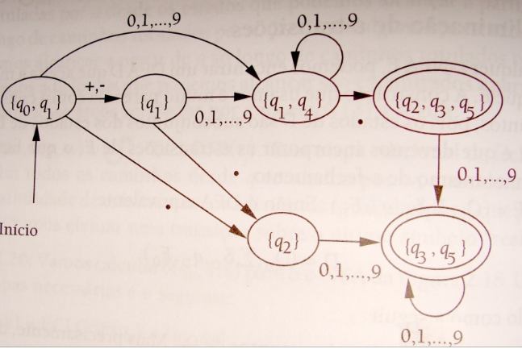

# Exemplos Práticos de Uso do Simulador
Este documento fornece exemplos de como modelar diferentes Autômatos Finitos Determinísticos (AFDs) no arquivo afds.json e como testá-los no simulador, com base na configuração fornecida.

## Exemplo 1: AFD que aceita cadeias com número ÍMPAR de zeros
- **Descrição Formal:**
  - Q: ```{par, impar}```
  - Σ: ```{0, 1}```
  - q0: ```par```
  - F: ```{impar}```

- **Definição no afds.json:**
 
```
{
  "descricao": "Aceita cadeias binárias com número ÍMPAR de zeros.",
  "estados": ["par", "impar"],
  "alfabeto": {
    "isolados": ["0", "1"]
  },
  "estadoInicial": "par",
  "estadosFinais": ["impar"],
  "transicoes": {
    "par": { "0": "impar", "1": "par" },
    "impar": { "0": "par", "1": "impar" }
  }
}
```

- **Simulação no Terminal:**
```
> 01100
   Caminho: par --(0)-> impar --(1)-> impar --(1)-> impar --(0)-> par --(0)-> impar
   Resultado: ✅ ACEITA (Estado final "impar" é um estado de aceitação).

> 11010
   Caminho: par --(1)-> par --(1)-> par --(0)-> impar --(1)-> impar --(0)-> par
   Resultado: ❌ REJEITA (Estado final "par" não é um estado de aceitação).
```

## Exemplo 2: AFD que reconhece números (versão convertida de AFN)


- **Descrição Formal:**
  - Q: ```{q0q1, q1, q1q4, q2, q2q3q5, q3q5, q_erro}```
  - Σ: ```{+, -, ., 0, 1, 2, 3, 4, 5, 6, 7, 8, 9}```
  - q0: ```q0q1```
  - F: ```{q2q3q5, q3q5}```

- **Definição no afds.json:**
 
```
{
  "descricao": "Reconhece números (inteiros e de ponto flutuante, com sinal opcional).",
  "estados": ["q0q1", "q1", "q1q4", "q2", "q2q3q5", "q3q5", "q_erro"],
  "alfabeto": {
    "grupos": {
      "digito": "0,1,2,3,4,5,6,7,8,9",
      "sinais": "+,-"
    },
    "isolados": ["."]
  },
  "estadoInicial": "q0q1",
  "estadosFinais": ["q2q3q5", "q3q5"],
  "transicoes": {
    "q0q1":   { "digito": "q1q4", "sinais": "q1", ".": "q2" },
    "q1":     { "digito": "q1q4", "sinais": "q_erro", ".": "q2" },
    "q1q4":   { "digito": "q1q4", "sinais": "q_erro", ".": "q2q3q5" },
    "q2":     { "digito": "q3q5", "sinais": "q_erro", ".": "q_erro" },
    "q3q5":   { "digito": "q3q5", "sinais": "q_erro", ".": "q_erro" },
    "q2q3q5": { "digito": "q3q5", "sinais": "q_erro", ".": "q_erro" },
    "q_erro": { "sinais": "q_erro", ".": "q_erro", "digito": "q_erro" }
  }
}
```

- **Simulação no Terminal:**
```
> +12.5
   Caminho: q0q1 --(+)-> q1 --(1)-> q1q4 --(2)-> q1q4 --(.)-> q2q3q5 --(5)-> q3q5
   Resultado: ✅ ACEITA (Estado final "q3q5" é um estado de aceitação).

> 9.
   Caminho: q0q1 --(9)-> q1q4 --(.)-> q2q3q5
   Resultado: ✅ ACEITA (Estado final "q2q3q5" é um estado de aceitação).

> .5
   Caminho: q0q1 --(.)-> q2 --(5)-> q3q5
   Resultado: ✅ ACEITA (Estado final "q3q5" é um estado de aceitação).

> 123
   Caminho: q0q1 --(1)-> q1q4 --(2)-> q1q4 --(3)-> q1q4
   Resultado: ❌ REJEITA (Estado final "q1q4" não é um estado de aceitação).

> 1.2.3
   Caminho: q0q1 --(1)-> q1q4 --(.)-> q2q3q5 --(2)-> q3q5 --(.)-> q_erro
   Resultado: ❌ REJEITA (Estado final "q_erro" não é um estado de aceitação).
```
